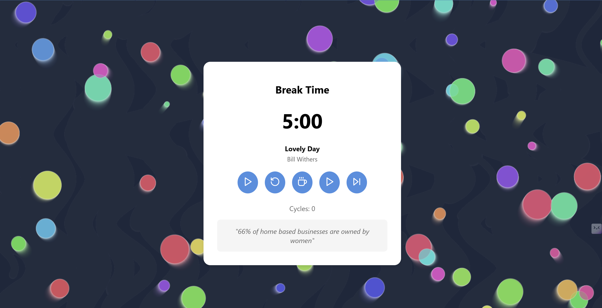
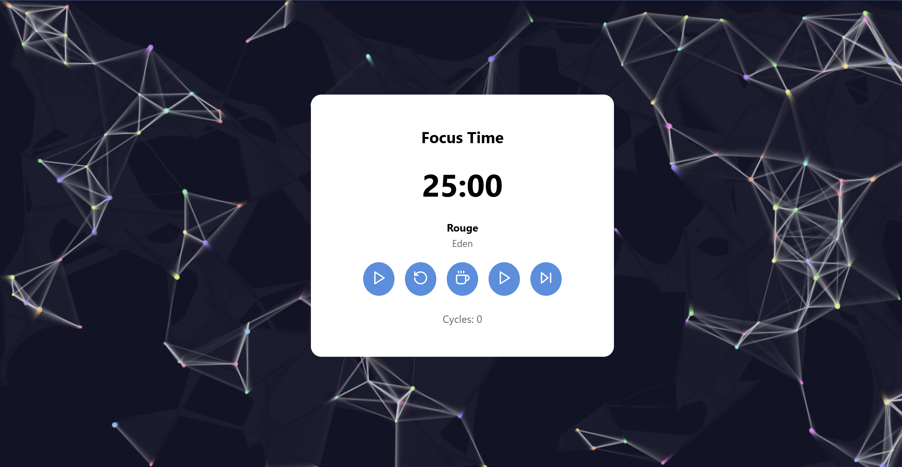

Here’s a sample `README.md` file for your React-based Pomodoro Timer project:
# Pomodoro Timer with Spotify Integration 🎶

This project is a **Pomodoro Timer** application built with **React.js**. It integrates with the **Spotify API** to play curated playlists during focus and break sessions and displays random facts for user duting break time. This timer uses various animations to create a calm and engaging background experience.

## Features
- **Pomodoro Timer:** Toggle between focus (25 minutes) and break (5 minutes) modes.
- **Spotify Playlist Integration:** Plays 'Deep Focus' and 'Cheerful Uplifting Mix' music playlists from Spotify for focus and break sessions respectively.
- **Audio Controls:** Play, pause, and skip tracks.
- **Random Facts:** Fetches a random fact during each break to distract person's attention during break time.
- **Background Animations:** Animated backgrounds that switch based on the timer mode.

## Screenshots



## Getting Started

### Prerequisites
- Node.js
- Spotify API credentials (Client ID and Secret)
- API key for the API Ninjas to fetch random facts 

### Installation
1. Clone the repository:
   ```bash
   git clone https://github.com/yourusername/pomodoro-timer-spotify.git
   cd pomodoro-timer-spotify
   ```

2. Install dependencies:
   ```bash
   npm install
   ```

3. Create a `.env` file in the root directory with your API keys:
   ```plaintext
   REACT_APP_SPOTIFY_CLIENT_ID=your_spotify_client_id
   REACT_APP_SPOTIFY_CLIENT_SECRET=your_spotify_client_secret
   REACT_APP_FACT_API=your_fact_api_key
   ```

4. Start the application:
   ```bash
   npm start
   ```

## Usage
- **Start/Pause Timer**: Click the **Play/Pause** button to control the timer.
- **Switch Modes**: Click the **Coffee** button to switch between focus and break modes.
- **Control Music**: Use the **Play/Pause** and **Skip** buttons to control audio playback.

## Customization
To change the playlists:
- Update the playlist IDs in `PomodoroTimer.js` for the `focus` and `break` playlists with the IDs of your choice.

## Future Enhancements
- Add more background animations.
- Make a database of playlists tailored for focus and break sessions
- Extend with additional Pomodoro features like custom focus/break times.
